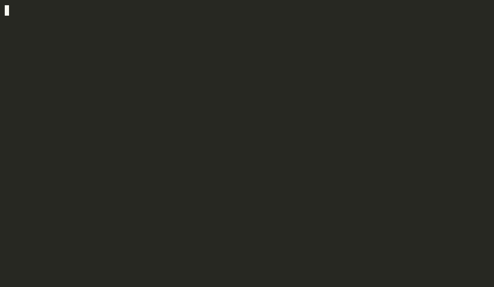
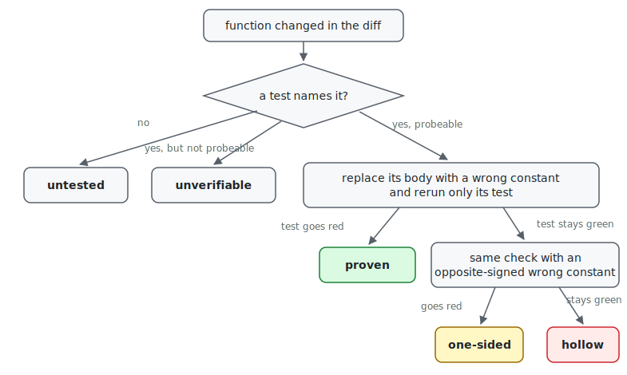

# Gutcheck

[](https://github.com/beepometer/gutcheck/actions/workflows/ci.yml)
[](https://www.npmjs.com/package/gutcheck)
[](LICENSE)




Gutcheck is a deterministic verification gate for AI coding agents. It runs when an agent marks
a task complete (and on pull requests) and checks whether each changed function is verified by a test.
Its report shows which functions are **proven**, which have **no binding test**, and which have
a **hollow** test that still passes when the function is broken.

Gutcheck verifies this by replacing each changed function with an incorrect return value and rerunning
the relevant test. If the test fails, the function is verified. A test that stays green is gutted
again with an opposite-signed wrong value before being called hollow—one that catches only one
direction is reported **one-sided** and never blocks. If Gutcheck cannot confirm the result,
it reports the function as unverifiable or skipped with a stated reason.

It runs in three places, same verdicts on every surface:

| Surface | When it runs                       | What can block |
|---|------------------------------------|---|
| **in-loop gate** | the agent's done-claim (Stop hook) | a hollow or already-failing test—once, with the receipt |
| **CI action** | every pull request                 | fails the job on hollow (`fail-on-hollow: false` to report only) |
| **CLI** (`gutcheck`) | manually on demand                 | exit 1 on hollow |

## What the verdicts mean

Every changed function takes one path through the probe:

<picture>
  <source media="(prefers-color-scheme: dark)" srcset="docs/assets/verdict-flow-dark.svg">
  
</picture>

| Verdict | Meaning | Blocks the gate? |
|---|---|---|
| proven | the function was gutted, its test was rerun, the test failed | no |
| hollow | the test passed over the gutted function, confirmed with an opposite-signed wrong value before it is ever reported, so the accusation is never a sign accident | **yes** |
| one-sided | the test goes red under one wrong value but not the other, it binds one direction of error (a threshold-style oracle) | no |
| unverifiable | tests reference it, but the probe could not verify any of them: a limit of the probe, not proof the tests are weak | no |
| untested | no test mentions it | no |

`proven` means the tests bind the function, not that the code is correct: a test can pin a wrong
value and still bind. How each verdict is established, and the fail-closed paths that stop the
probe from ever inventing one, are in [how it works](docs/how-it-works.md).

## Gate the agent loop

One shared gate (`gutcheck gate --harness=<name>`) runs at the agent's done-claim — the moment the
agent declares the task finished. Claude Code ships it as a default-on plugin:

```
/plugin marketplace add beepometer/gutcheck
/plugin install gutcheck@gutcheck
```

On each stop the hook re-probes the tests the agent changed since session start (the plugin
records HEAD at startup, so committed work is still covered). The everyday result is a
non-blocking coverage line spoken back into the loop:

```
gutcheck: of 3 function(s) you changed — 1 proven, 2 with no binding test. (npx gutcheck --explain <file:line> for a receipt.)
```

The gate blocks the done-claim — once — only on two execution-backed signals: a hollow test, or a
changed test that already fails before any mutation runs. Each finding names its receipt, and for
a failing test, the runner's own failure text:

```
- test/cart.test.mjs:9 'computes the total' — stays green even when computeTotal() (src/cart.mjs) returns a wrong value.
```

Untested or unverifiable functions never block. The probe is diff-scoped, capped (20 functions,
90 seconds), and memoized per diff; a stop that touched nothing costs a git diff plus the
self-check — a few seconds the first time, about half a second on memoized repeats. Hooks are bash
and run on macOS and Linux. Caps, cost, the context hooks, and the opt-outs (`.gutcheck-off`,
`GUTCHECK_HOOK=off`) are in [hooks/README.md](hooks/README.md).

Codex CLI, Cursor, Copilot's coding agent, Antigravity, and aider get the same shared gate as a
template you register yourself—none is installed by default. Mechanism, install steps, and
honest boundaries for each are in [integrations/README.md](integrations/README.md); the opt-outs
are shared across every harness. The Claude Code plugin also adds `/gutcheck:check` and an opt-in
read-only citation-verifier agent (it checks that cited sources actually say what the agent
claims — the same trust problem, applied to prose).

To use a clone without installing: `claude --plugin-dir <repo>/dist/gutcheck`. Verdicts are the
same on every surface, so an agent and a reviewer read the same report.

## Gate pull requests

Whatever wrote the code—Cursor, Codex, Devin, aider, a human—the probe checks the PR diff.
One step in a workflow:

```yaml
permissions: { contents: read, pull-requests: write }
steps:
  - uses: actions/checkout@v4
    with: { fetch-depth: 0 }
  - uses: beepometer/gutcheck@v0   # or pin a full commit SHA
```

The action probes the PR diff (never silently widening to a full-suite scan), annotates hollow and
already-failing tests inline, writes the job summary, and keeps a sticky PR comment with the
verification table. It fails the job by default when a hollow test is found; `fail-on-hollow:
false` reports without failing.

<details>
<summary>What the sticky PR comment looks like — real <code>--format=markdown</code> output on the README's cart example (excerpt)</summary>

**3 functions changed** · proven 1 · hollow 1 · unverifiable 0 · untested 1

*probed 3 fns · 1/2 bound · 0 tests skipped · runner node*

| Function | File | Status | Evidence |
| --- | --- | --- | --- |
| `countItems` | src/cart.mjs | proven | test/cart.test.mjs:7 'counts items' went red when gutted |
| `computeTotal` | src/cart.mjs | hollow | test/cart.test.mjs:9 'computes the total' still passes when gutted |
| `applyDiscount` | src/cart.mjs | untested | no test mentions it |

*Evidence classes: **proven/hollow** are execution-backed (we mutated the function and reran its test). **unverifiable/untested** are name-search (a same-named function elsewhere can confuse them). Only value-pinning tests with locatable functions are probeable — the per-reason skip breakdown is in the default report and `--json` output.*

</details>

Inputs: `path`, `since`, `max-probes` (defaults to 40), `comment`, `sarif-file`, `fail-on-hollow`,
`node-version` — see [action.yml](action.yml). For full control, copy
[`ci/gutcheck.yml`](ci/gutcheck.yml) into `.github/workflows/`.

The probe executes your project's own test suite. Run it on `pull_request`, as above, and never on
`pull_request_target`—that pattern runs untrusted PR test code with access to your secrets. Pin
the action to a tag or SHA. More in [running it safely](docs/limits.md#running-it-safely).

## Try it on your own diff

Node 20 or newer, no install:

```bash
npx gutcheck --demo                # planted two-test example, a catch in seconds, no project needed
npx gutcheck --since origin/main   # probe your diff
```

The report on a real diff — three changed functions, two tests, all green in CI:

```console
$ npx gutcheck --since origin/main

gutcheck self-check ✓ — caught its planted fake test, passed its planted real test
gutcheck: 3 functions in this diff — 1 proven (1 via tests changed in this diff), 1 HOLLOW, 1 with no binding test.

hollow — the test passes even when the function is gutted; fix the test (receipt: gutcheck --explain <file:line>) (1):
  ✗ test/cart.test.mjs:9  'computes the total'  — survives gutting computeTotal()

no binding test — no test names it (1):
  applyDiscount

  (probed 2 fns · 1/2 bound · 0 skipped · runner node)
```

*countItems is proven (gutting it made its test go red) so it gets no line of its own — only
problems do. computeTotal's test computes its expected value from computeTotal itself, so it
survives gutting: hollow. applyDiscount has no test at all. The first line is gutcheck checking
itself: it plants a fake test and a real one in a scratch directory and refuses to run unless it
catches the fake.*

`--explain` prints the receipt—the evidence behind any single verdict:

```console
$ gutcheck --explain test/cart.test.mjs:9
test/cart.test.mjs:9 'computes the total'
  → HOLLOW. gutcheck replaced computeTotal() (src/cart.mjs)'s body with `return 987654321` and reran only this test.
  before: PASS   after gutting computeTotal() (src/cart.mjs): PASS  ← the test can't tell the function is broken.
  Fix: assert the real expected value, not one re-derived from the function under test.
```

Every flag, the exit-code contract (0 clean · 1 hollow found · 2 usage error), and `gutcheck lint`
(sub-second static checks on test files) are in the [CLI reference](docs/cli.md).

## Does it fit your project?

| Language | Runners |
|---|---|
| JavaScript / TypeScript | vitest, jest, mocha, ava, node:test (auto-detected) |
| Python | pytest |
| Kotlin / Java + Android | Gradle (JUnit 4/5, kotlin.test, AssertJ; `testDebugUnitTest`, incl. Robolectric); Maven (JUnit 4/5, single- and multi-module) |

**Strongest fit**—code whose tests pin concrete values:

- calculation-heavy logic: pricing, scoring, physics, signal processing, unit conversion—anything
  checked against published reference values
- parsers, formatters, serializers, validators—pure functions with literal expectations
- large, slow suites: the probe is diff-scoped and reruns only the covering test, so total suite
  runtime doesn't matter

**Thin fit**—the probe reaches little:

- mock-, dependency-injection-, and UI-heavy code: few functions are probeable, so the report's
  value is the untested/unverifiable denominator rather than proven/hollow verdicts
- suites that assert relations or behavior without ever pinning a value
- instrumented Android tests (`androidTest`) and Kotlin Multiplatform native/JS targets—
unsupported, reported as such rather than guessed

Full detail: [scope and limits](docs/limits.md).

## Prior art and license

Mutation testing is old and good; PIT, Stryker, and mutmut are full-strength implementations. The
gut-the-whole-body restriction is 'extreme mutation', published as pseudo-tested methods
([Niedermayr et al., 2016](https://arxiv.org/abs/1611.07163)) and shipped for the JVM as PIT's
[Descartes](https://github.com/STAMP-project/pitest-descartes) plugin. What Gutcheck adds is the
per-diff verdict report at the agent's done-claim, fail-closed discipline, per-test targeted
reruns, replayable receipts, and the agent-loop and CI integrations. If you need full mutant
coverage (boundary and condition mutants), use the full-strength tools. MIT license.
